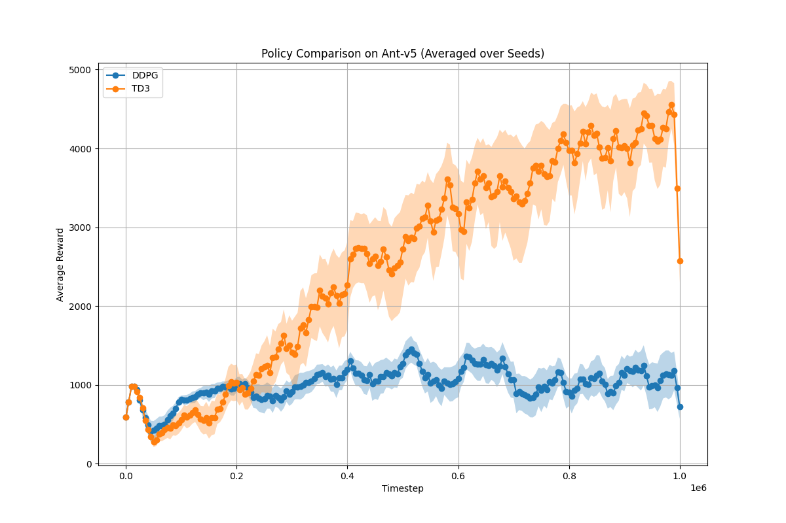
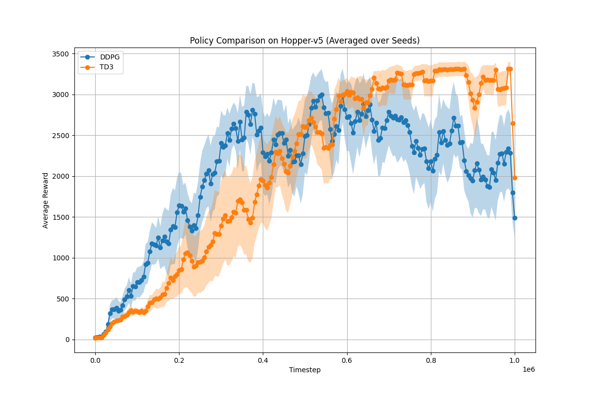

# Addressing Function Approximation Error in Actor-Critic Methods

PyTorch implementation of Twin Delayed Deep Deterministic Policy Gradients (TD3). Forked from the [paper](https://arxiv.org/abs/1802.09477) repository [here](https://github.com/sfujim/TD3).

Method is tested on [MuJoCo](http://www.mujoco.org/) continuous control tasks in [OpenAI gym](https://github.com/openai/gym).
Networks are trained using [PyTorch 2.9](https://github.com/pytorch/pytorch) and Python 3.9+.

## Reimplementation Results
We rerun their MuJoCo experiments with the exaact same hyperparameters and get the following results.

### Performance (Time and Final Reward)

Based on [results/training_times.csv](results/training_times.csv) and [results/final_rewards.csv](results/final_rewards.csv):

| Environment               | TD3 Reward (±)  | TD3 Time (min ±) | DDPG Reward (±) | DDPG Time (min ±) |
| ------------------------- | --------------- | ---------------- | --------------- | ----------------- |
| Ant-v5                    | 3944.0 ± 785.0  | 69.0 ± 0.5       | 1308.5 ± 196.3  | 76.8 ± 0.7        |
| HalfCheetah-v5            | 11057.6 ± 91.8  | 55.4 ± 0.2       | 9273.9 ± 517.9  | 59.2 ± 0.2        |
| Hopper-v5                 | 3304.1 ± 88.6   | 56.2 ± 0.6       | 2102.8 ± 442.5  | 59.8 ± 0.2        |
| InvertedDoublePendulum-v5 | 7695.4 ± 1623.5 | 56.2 ± 0.2       | 9275.6 ± 23.6   | 59.8 ± 0.2        |
| InvertedPendulum-v5       | 1000.0 ± 0.0    | 53.4 ± 0.2       | 1000.0 ± 0.0    | 57.4 ± 0.2        |
| Reacher-v5                | -3.1 ± 0.7      | 48.6 ± 0.2       | -5.9 ± 1.6      | 53.2 ± 0.2        |
| Walker2d-v5               | 4253.9 ± 130.7  | 57.4 ± 0.4       | 1988.5 ± 408.2  | 58.8 ± 0.2        |


### Visualizations
The [notebook](./DDPG+TD3_notebook.ipynb) provides interactive results and visualizations for Reacher-v5. Here we provide the other results -







## Project Structure

- `DDPG.py` - Original DDPG implementation (400-300 architecture)
- `OurDDPG.py` - Re-tuned DDPG implementation (256-256 architecture)
- `TD3.py` - TD3 implementation with twin critics
- `utils.py` - Replay buffer implementation
- `main.py` - Training script for running experiments
- `DDPG+TD3_notebook.ipynb` - **Self-contained Jupyter notebook for experimentation**

## Installation

### Prerequisites
- Python 3.9 or higher
- CUDA-capable GPU (recommended)

### Setup

1. **Clone the repository** (if applicable):
```bash
cd DRL_Group2_DDPG_TD3
```

2. **Create a virtual environment** (recommended):
```bash
python3 -m venv venv
source venv/bin/activate  # On Windows: venv\Scripts\activate
```

3. **Install dependencies**:
```bash
pip install -r requirements.txt
```

### Dependencies

The project requires the following packages (see `requirements.txt`):
- `gymnasium==1.2.1` - OpenAI Gym environments
- `matplotlib==3.10.7` - Plotting and visualization
- `numpy==2.3.4` - Numerical computations
- `torch==2.9.0+cu126` - PyTorch with CUDA support
- `tqdm==4.67.1` - Progress bars
- `tensorboard` - TensorBoard logging and visualization
- `jupyter` - Jupyter notebook interface
- `ipykernel` - Jupyter kernel for Python

## Usage

### Running the Jupyter Notebook (Recommended for Quick Start)

The **DDPG+TD3_notebook.ipynb** provides a self-contained, interactive way to run and compare both algorithms:

1. **Launch Jupyter**:
```bash
jupyter notebook
```

2. **Open the notebook**:
   - Navigate to `DDPG+TD3_notebook.ipynb` in your browser

3. **Run all cells**:
   - Click "Cell" → "Run All" or run cells individually

### Running the code on PACE (To recreate all Experiments)
```sbatch scripts/queue_all.sh
```

### Hyperparameters

Modify hyperparameters via command-line arguments to `main.py`:

```bash
python main.py \
  --env Reacher-v5 \
  --seed 0 \
  --max_timesteps 1000000 \
  --start_timesteps 25000 \
  --eval_freq 5000 \
  --batch_size 256 \
  --discount 0.99 \
  --tau 0.005 \
  --policy_noise 0.2 \
  --noise_clip 0.5 \
  --policy_freq 2 \
  --expl_noise 0.1
```

## Algorithms Comparison

### DDPG vs TD3

| Feature | DDPG (DDPG.py) | OurDDPG (OurDDPG.py) | TD3 (TD3.py) |
|---------|----------------|---------------------|--------------|
| **Architecture** | 400-300 | 256-256 | 256-256 (twin) |
| **Learning Rate** | 1e-4 (actor) | 3e-4 | 3e-4 |
| **Tau** | 0.001 | 0.005 | 0.005 |
| **Batch Size** | 64 | 256 | 256 |
| **Critic Networks** | Single | Single | Twin (Q1, Q2) |
| **Policy Updates** | Every step | Every step | Delayed (every 2 steps) |
| **Target Smoothing** | No | No | Yes |

**Note**: The notebook uses the exact implementations from DDPG.py and TD3.py for accurate replication of results.


## Project Modifications

### Changes from Original TD3 Paper Repository

1. **Environment Updates**: Updated from `gym` to `gymnasium` (v1.2.1)
2. **Environment Names**: Changed from `-v2` to `-v5` (e.g., `HalfCheetah-v2` → `HalfCheetah-v5`)
3. **PyTorch Version**: Updated to PyTorch 2.9 with CUDA 12.6 support
4. **Notebook Added**: New self-contained Jupyter notebook for easy experimentation with 1M timesteps
5. **Visualization**: Notebook uses Matplotlib instead of TensorBoard for direct comparisons
6. **Comparison Script**: Added `compare_td3_ddpg.py` for multi-seed statistical analysis


## Citation

```bibtex
@inproceedings{fujimoto2018addressing,
  title={Addressing Function Approximation Error in Actor-Critic Methods},
  author={Fujimoto, Scott and Hoof, Herke and Meger, David},
  booktitle={International Conference on Machine Learning},
  pages={1582--1591},
  year={2018}
}
```

## References

- [TD3 Paper](https://arxiv.org/abs/1802.09477)
- [DDPG Paper](https://arxiv.org/abs/1509.02971)
- [TD3 Official Implementation](https://github.com/sfujim/TD3)
- [OpenAI Baselines](https://github.com/openai/baselines) - For DDPG, PPO, TRPO, ACKTR comparisons
- [Learned Agent Video](https://youtu.be/x33Vw-6vzso)

## Troubleshooting

### CUDA Out of Memory
Reduce batch size in hyperparameters:
```python
batch_size = 128  # Instead of 256
```

### Jupyter Kernel Dies
Reduce max_timesteps or eval_freq to lower memory usage:
```python
max_timesteps = int(2e5)  # Instead of 5e5
```

## License

This project is based on the original TD3 implementation. Please cite the paper if you use this code.
